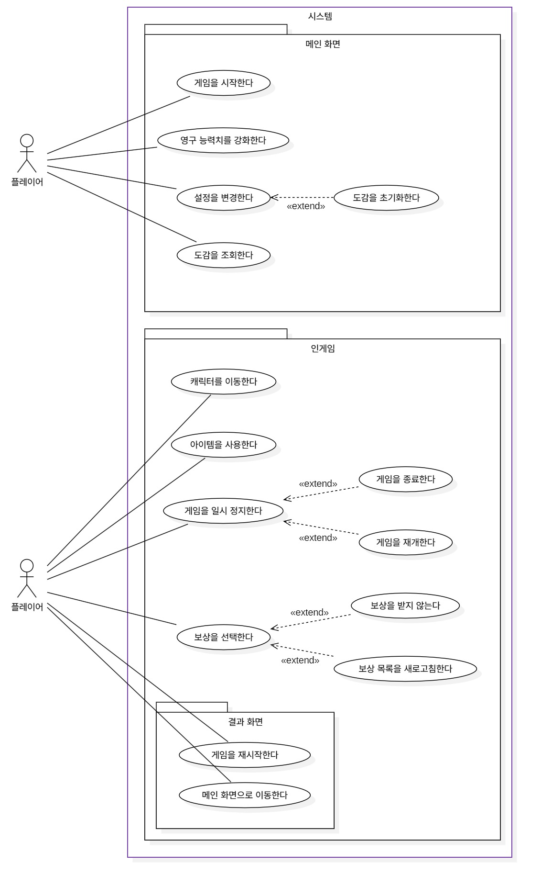
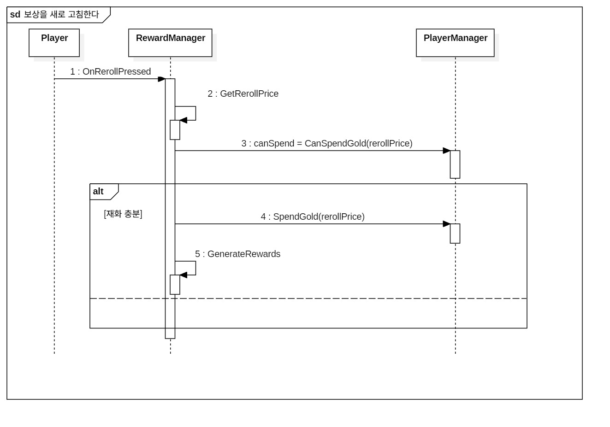
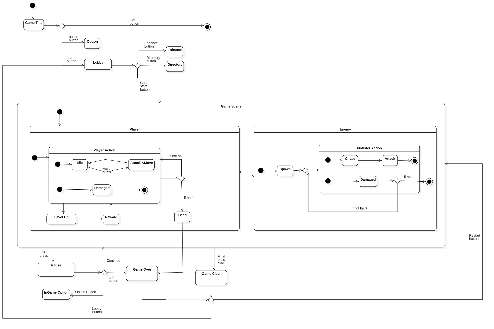

# [로그라이크 프로젝트]

## 💻 팀원 목록

| 학번       | 이름  | 이메일                    |
|:---------|:----|:-----------------------|
| 22012139 | 김도경 | kjkkjs5252@gmail.com   |
| 22012140 | 김병규 | rlaqudrbabcd@gmail.com |
| 22112089 | 백승헌 | hun4758@gmail.com      |
| 22213499 | 정태현 | ghgh036034@gmail.com   |
| 22311884 | 유민서 | winteryu21@gmail.com   |
| 22313530 | 배원일 | dnjsdlf325@gmail.com   |

## 📜 Revision history

| Revision date | Version # | Description                       | Author |
|:--------------|:----------|:----------------------------------|:-------|
| 10/29/2025    | 1.00      | Use Case Diagram 및 Description 작성 | 유민서    |
| 11/07/2025    | 2.00      | 11월 1주차 검토 완료                     | 유민서    |

## = Contents =

* [1. Introduction](#1-introduction)
* [2. Use case analysis](#2-use-case-analysis)
* [3. Class diagram](#3-class-diagram)
* [4. Sequence diagram](#4-sequence-diagram)
* [5. State machine diagram](#5-state-machine-diagram)
* [6. User interface prototype](#6-user-interface-prototype)
* [7. Implementation requirements](#7-implementation-requirements)
* [8. Glossary](#8-glossary)
* [9. References](#9-references)

---

# 1. Introduction

&ensp;본 문서는 우리 팀이 개발하고자 하는 탑다운 시점 로그라이크 액션 게임 프로젝트의 Software Design Specification(SDS)이다. 게임 개발 과정에서 필요한 기능적 요구사항을 구체화하고, 시스템의 구조적 및 동작적 설계 내용을 명확히 제시하는 것을 목적으로 한다. 

&ensp;SDS는 게임의 핵심 시스템과 주요 기능을 정의하여 프로젝트 구성원이 공통된 이해를 바탕으로 일관성 있는 개발을 진행할 수 있도록 지원하며, 향후 유지보수 및 확장 개발 시 표준 참조 문서로 활용된다.

&ensp;Use Case Analysis는 사용자 관점에서의 주요 기능 및 시나리오를 정의하였고, Class Diagram은 시스템의 구조 및 클래스 간 관계를 나타낸다. 

&ensp;Sequence Diagram과 State Machine Diagram은 게임 시스템의 동작 흐름 및 상태 전이 과정을 기술하며, User Interface 설계는 게임의 화면 구성과 사용자 인터페이스 동작을 묘사하였다.
본 SDS 문서에서는 각 다이어그램과 구성 요소 간의 일관성 검토를 중요하게 생각했다. 특히, 메서드 명칭이나 호출 구조의 불일치는 설계 및 구현상의 오류로 이어질 수 있기 때문에 Class Diagram에 정의된 메서드 이름이 Sequence Diagram에서 동일하게 사용되었는지를 검토했다. 또한, UI Prototype의 화면 전환 흐름이 GameManager의 State Machine Diagram과 일치하는지 검토해야 하며, 게임의 상태가 UI 설계와 정확히 대응되어야 한다.

&ensp;본 프로젝트는 다음과 같은 개발 환경과 도구를 기반으로 진행된다. 게임 엔진은 Unity를 사용하고, 개발 언어는 C#을 사용한다. Unity 엔진을 활용한 개발은 빠른 프로토타이핑과 다양한 플랫폼 지원을 가능하게 한다. GitHub을 통한 형상 관리는 협업 효율성과 버전 추적의 용이성을 제공한다.

---

# 2. Use case analysis

## 2.1 Use Case Diagram

&ensp;본 2장에서는 사용자가 시스템을 통해 수행할 수 있는 기능들을 식별하고 명세하는 Use Case Diagram과 Use Case Description을 제공한다.

&ensp;아래의 Use Case Diagram은 사용자의 흐름에 따라 시스템을 '메인 화면', '인게임', '결과 화면'의 세 가지 패키지(Package)로 나누어 구성하였다. 이를 통해 각 시나리오에서 사용자가 수행할 수 있는 주요 기능(Use Case)과, 특정 조건에서만 발생하는 확장 관계(<<extend>>)를 시각적으로 명확히 파악할 수 있다.

## 2.2 Use Case Descriptions

### Use case #[1] : 게임을 시작한다

| **GENERAL CHARACTERISTICS** |                                             |
|:----------------------------|:--------------------------------------------|
| **Summary**                 | 플레이어가 메인 화면에서 인게임 씬으로 진입하는 기능               |
| **Scope**                   | 메인 화면                                       |
| **Level**                   | User level                                  |
| **Author**                  | 유민서                                         |
| **Last Update**             | 2025. 10. 29                                |
| **Status**                  | Analysis                                    |
| **Primary Actor**           | 플레이어                                        |
| **Preconditions**           | 플레이어가 '메인화면' 씬에 있어야 한다.                     |
| **Trigger**                 | 플레이어가 '게임 시작' 버튼을 클릭했을 때                    |
| **Success Post Condition**  | 현재 씬이 '인게임'으로 전환된다.                         |
| **Failed Post Condition**   | 실패 조건 없음                                    |

| **MAIN SUCCESS SCENARIO** |                                                  |
|:--------------------------|:-------------------------------------------------|
| **Step**                  | **Action**                                       |
| S                         | 플레이어가 게임을 시작한다.                                  |
| 1                         | 이 Use case는 플레이어가 메인 화면에서 '게임 시작' 버튼을 누를 때 시작된다. |
| 2                         | 시스템은 씬을 '메인 화면'에서 '인게임'으로 전환한다.                  |
| 3                         | 시스템은 인게임 시스템(타이머, 몬스터 스폰 등)을 초기화하고 동작시킨다.        |
| 4                         | 이 Use case는 인게임 씬이 성공적으로 로드되면 종료된다.              |

| **RELATED INFORMATION** |              |
|:------------------------|:-------------|
| **Performance**         | 씬 로딩 시간 ≤ 3초 |
| **Frequency**           | 세션 당 1회      |
| **Concurrency**         |              |
| **Due Date**            |              |

### Use case #[2] : 게임을 일시 정지한다

| **GENERAL CHARACTERISTICS** |                                                 |
|:----------------------------|:------------------------------------------------|
| **Summary**                 | 플레이어가 게임의 모든 동작을 멈추고 일시 정지 화면을 호출하는 기능          |
| **Scope**                   | 인게임                                             |
| **Level**                   | User level                                      |
| **Author**                  | 유민서                                             |
| **Last Update**             | 2025. 11. 06.                                   |
| **Status**                  | Analysis                                        |
| **Primary Actor**           | 플레이어                                            |
| **Preconditions**           | 플레이어가 '인게임' 씬에서 게임을 플레이 중이어야 한다.                |
| **Trigger**                 | 플레이어가 ESC 키를 눌렀을 때                              |
| **Success Post Condition**  | 게임의 모든 인게임 시스템 동작이 일시 중단되고, 일시 정지 화면이 호출된다.     |
| **Failed Post Condition**   | 실패 조건 없음                                        |

| **MAIN SUCCESS SCENARIO** |                                                          |
|:--------------------------|:---------------------------------------------------------|
| **Step**                  | **Action**                                               |
| S                         | 플레이어가 게임을 일시 정지한다.                                       |
| 1                         | 이 Use case는 플레이어가 ESC 키를 누르거나, 게임 프로세스가 포커스를 잃었을 때 시작된다. |
| 2                         | 시스템은 시간 측정, 몬스터 이동 등 모든 인게임 시스템 동작을 중단시킨다.               |
| 3                         | 시스템은 일시 정지 화면을 호출하며, 현재 진행 상황(보유 장비 등)을 요약하여 표시한다.       |
| 4                         | 시스템은 플레이어의 '계속하기' 또는 '게임 종료' 선택을 대기한다.                   |

| **EXTENSION SCENARIOS** |                                                                                                                  |
|:------------------------|:-----------------------------------------------------------------------------------------------------------------|
| **Step**                | **Branching Action**                                                                                             |
| 4                       | 4a. 플레이어가 '계속하기' 버튼을 클릭한다.   …4a1. 시스템은 일시 정지 화면을 닫고, 중단되었던 모든 인게임 시스템 동작을 재개한다. ...4a2. Use Case가 종료된다. |
| 4                       | 4b. 플레이어가 '게임 종료' 버튼을 클릭한다.   ...4b1. 시스템은 전체 게임 시스템을 종료한다.                                                  |

| **RELATED INFORMATION** |                 |
|:------------------------|:----------------|
| **Performance**         | 즉시 반응 ≤ 0.1초    |
| **Frequency**           | 플레이어의 판단에 따라 다름 |
| **<Concurrency>**       | 제한 없음           |
| **Due Date**            |                 |

### Use case #[3] : 보상을 선택한다

| **GENERAL CHARACTERISTICS** |                                                 |
|:----------------------------|:------------------------------------------------|
| **Summary**                 | 플레이어가 레벨 업 또는 보스 처치 시 나타나는 3개의 보상 중 하나를 선택하는 기능 |
| **Scope**                   | 인게임                                             |
| **Level**                   | User level                                      |
| **Author**                  | 유민서                                             |
| **Last Update**             | 2025. 10. 29.                                   |
| **Status**                  | Analysis                                        |
| **Primary Actor**           | 플레이어                                            |
| **Preconditions**           | 플레이어의 캐릭터가 레벨 업 하거나, 보물 상자를 획득해야 한다.            |
| **Trigger**                 | 시스템이 '보상 화면'을 호출했을 때                            |
| **Success Post Condition**  | 플레이어가 선택한 보상이 캐릭터에 적용되고, 보상 화면이 닫힌 후 게임이 재개된다.  |
| **Failed Post Condition**   | 실패 조건 없음                                        |

| **MAIN SUCCESS SCENARIO** |                                                |
|:--------------------------|:-----------------------------------------------|
| **Step**                  | **Action**                                     |
| S                         | 플레이어가 보상을 선택한다.                                |
| 1                         | 이 Use case는 시스템이 보상 화면을 호출할 때 시작된다.            |
| 2                         | 시스템은 3개의 선택 가능한 보상 목록을 표시한다.                   |
| 3                         | 플레이어가 3개의 보상 중 하나를 선택하고 클릭한다.                  |
| 4                         | 시스템은 선택된 보상('장비 획득' 또는 '기존 장비 강화')을 캐릭터에 적용한다. |
| 5                         | 시스템은 보상 화면을 닫고 게임을 재개한다.                       |
| 6                         | 이 Use case는 보상 적용이 완료되면 종료된다.                  |

| **EXTENSION SCENARIOS** |                                                                                                                                             |
|:------------------------|:--------------------------------------------------------------------------------------------------------------------------------------------|
| **Step**                | **Branching Action**                                                                                                                        |
| 3                       | 3a. 플레이어가 '보상 목록 새로고침' 버튼을 클릭한다 …3a1. 시스템은 'Use Case #[4] : 보상을 새로 고침한다'를 실행한다. …3a2. 'Use Case #[4]'가 성공적으로 종료되면, 3단계(보상 선택)로 돌아간다. |
| 3                       | 3b. 플레이어가 '건너뛰기'를 선택한다. …3b1. 시스템은 보상 화면을 닫고 플레이어에게 일정량의 경험치를 지급한다. ...3b2. Use case가 종료된다.                                         |

| **RELATED INFORMATION** |                      |
|:------------------------|:---------------------|
| **Performance**         | 즉시 반응 ≤ 0.1초         |
| **Frequency**           | 레벨 업 또는 보스 처치 시마다 발생 |
| **Concurrency**         | 제한 없음                |
| **Due Date**            |                      |

### Use case #[4] : 보상을 새로 고침한다.

| **GENERAL CHARACTERISTICS** |                                                                                                                                                                                                                                                                       |
|:----------------------------|:----------------------------------------------------------------------------------------------------------------------------------------------------------------------------------------------------------------------------------------------------------------------|
| **Summary**                 | 보상목록을 재화를 이용하여 새로고침 하는 기능                                                                                                                                                                                                                                             |
| **Scope**                   | 인게임                                                                                                                                                                                                                                                                   |
| **Level**                   | User level                                                                                                                                                                                                                                                            |
| **Author**                  | 김도경                                                                                                                                                                                                                                                                   |
| **Last Update**             | 2025. 11. 07.                                                                                                                                                                                                                                                         |
| **Status**                  | Analysis                                                                                                                                                                                                                                                              |
| **Primary Actor**           | 플레이어                                                                                                                                                                                                                                                                  |
| **Preconditions**           | (조건1) 플레이어가 보상 화면에 있어야 한다 (조건2) 플레이어의 재화가 '새로고침'에 필요한 양보다 많거나 같아야 한다. (조건3) 다음 조건 중 하나를 만족해야 함: - 플레이어의 장비 슬롯에 여유가 있다. - 플레이어의 장비 중 최대 레벨이 아닌 것이 하나 이상 있다.  > (참고): 사전 조건 2 또는 3이 충족되지 않으면, 이 Use Case는 시작될 수 없다. (이는 UI에서 '새로고침' 버튼이 비활성화됨을 의미한다.) |
| **Trigger**                 | 플레이어가 '새로고침' 버튼을 눌렀을때                                                                                                                                                                                                                                                 |
| **Success Post Condition**  | 보상 목록 3개가 전부 다른 것으로 새로고침 된다.                                                                                                                                                                                                                                          |
| **Failed Post Condition**   | 실패 조건 없음                                                                                                                                                                                                                                                              |

| **MAIN SUCCESS SCENARIO** |                                          |
|:--------------------------|:-----------------------------------------|
| **Step**                  | **Action**                               |
| S                         | 플레이어가 보상을 '새로고침' 한다.                     |
| 1                         | 이 Use case는 플레이어가 '새로고침' 버튼을 눌렀을 때 시작된다. |
| 2                         | 시스템은 플레이어의 재화를 소모한다.                     |
| 2                         | 시스템은 3개의 보상 목록을 새로고침하여 다시 표시한다.          |
| 3                         | 이 Use case가 종료된다.                        |

| **EXTENSION SCENARIOS** |                     |
|:------------------------|:--------------------|
| **Step**                | **BranchingAction** |
|

| **RELATED INFORMATION** |                        |
|:------------------------|:-----------------------|
| **Performance**         | 새로 고침 시간 ≤ 1초          |
| **Frequency**           | 플레이어가 새로고침 버튼을 누를 때 발생 |
| **Concurrency**         | 제한 없음                  |
| **Due Date**            |                        |

### Use case #[5] : 보상을 건너뛴다.

| **GENERAL CHARACTERISTICS** |                            |
|:----------------------------|:---------------------------|
| **Summary**                 | 보상목록을 건너뛰는 기능              |
| **Scope**                   | 인게임                        |
| **Level**                   | User level                 |
| **Author**                  | 김도경                        |
| **Last Update**             | 2025. 11. 07.              |
| **Status**                  | Analysis                   |
| **Primary Actor**           | 플레이어                       |
| **Preconditions**           | 플레이어가 보상 화면에 있어야한다.        |
| **Trigger**                 | 플레이어가 '건너뛰기' 버튼을 눌렀을 때     |
| **Success Post Condition**  | 보상 목록이 닫히고 일정량의 경험치를 획득한다. |
| **Failed Post Condition**   | 실패 조건 없음                   |

| **MAIN SUCCESS SCENARIO** |                                          |
|:--------------------------|:-----------------------------------------|
| **Step**                  | **Action**                               |
| S                         | 플레이어가 보상을 '건너뛰기' 한다.                     |
| 1                         | 이 Use case는 플레이어가 '건너뛰기' 버튼을 눌렀을 때 시작된다. |
| 2                         | 시스템은 보상 화면을 닫고 플레이어에게 일정량의 경험치를 지급한다.    |
| 3                         | Use Case가 종료된다.                          |

| **EXTENSION SCENARIOS** |                     |
|:------------------------|:--------------------|
| **Step**                | **BranchingAction** |
|

| **RELATED INFORMATION** |                          |
|:------------------------|:-------------------------|
| **Performance**         | 건너뛰기 시간 ≤ 1초             |
| **Frequency**           | 플레이어가 '건너뛰기' 버튼을 누를 때 발생 |
| **Concurrency**         | 제한 없음                    |
| **Due Date**            |                          |

### Use case #[6] : 캐릭터를 이동한다

| **GENERAL CHARACTERISTICS** |                                                  |
|:----------------------------|:-------------------------------------------------|
| **Summary**                 | 플레이어가 키보드를 조작하여 캐릭터를 맵 상에서 8방향으로 자유롭게 이동시키는 기능   |
| **Scope**                   | 인게임                                              |
| **Level**                   | User level                                       |
| **Author**                  | 유민서                                              |
| **Last Update**             | 2025. 11. 06.                                    |
| **Status**                  | Analysis                                         |
| **Primary Actor**           | 플레이어                                             |
| **Preconditions**           | 플레이어가 '인게임' 씬에서 게임을 플레이 중이며, 캐릭터가 움직일 수 있는 상태이다. |
| **Trigger**                 | 플레이어가 W, A, S, D 키 중 하나 이상을 누르고 있을 때             |
| **Success Post Condition**  | 캐릭터가 플레이어가 입력한 방향으로 이동한다.                        |
| **Failed Post Condition**   | 실패 조건 없음                                         |

| **MAIN SUCCESS SCENARIO** |                                                     |
|:--------------------------|:----------------------------------------------------|
| **Step**                  | **Action**                                          |
| S                         | 플레이어가 캐릭터를 이동한다.                                    |
| 1                         | 이 Use case는 플레이어가 W, A, S, D 중 하나 이상의 키를 누를 때 시작된다. |
| 2                         | 시스템은 플레이어의 키 입력(상하좌우 또는 대각선)을 감지한다.                 |
| 3                         | 캐릭터는 해당 방향으로 CHA.Stat.1에 정의된 '이동 속도'에 맞춰 이동한다.      |
| 4                         | 이 Use case는 플레이어가 키에서 손을 떼어 이동 입력을 멈출 때 종료된다.       |

| **EXTENSION SCENARIOS** |                                                                   |
|:------------------------|:------------------------------------------------------------------|
| **Step**                | **Branching Action**                                              |
| 3                       | 3a. 캐릭터가 이동 중 경험치 구슬 범위 내에 접근한다. …3a1. 경험치 구슬이 캐릭터 방향으로 끌려온다. |
| 3                       | 3b. 캐릭터가 이동 중 아이템 범위 내에 접근한다.  ...3b1. 해당 아이템의 갯수를 1개 증가시킨다.  |

| **RELATED INFORMATION** |                     |
|:------------------------|:--------------------|
| **Performance**         | 입력 지연 ≤ 0.05초       |
| **Frequency**           | 인게임 플레이 내내 지속적으로 발생 |
| **Concurrency**         | 제한 없음               |
| **Due Date**            |                     |

### Use case #[7] : 영구 능력치를 강화한다

| **GENERAL CHARACTERISTICS** |                                                |
|:----------------------------|:-----------------------------------------------|
| **Summary**                 | 플레이어가 능력치 강화화면에서 캐릭터의 기본 능력치를 올리는 기능           |
| **Scope**                   | 메인 화면                                          |
| **Level**                   | User level                                     |
| **Author**                  | 김병규                                            |
| **Last Update**             | 2025. 11. 06.                                  |
| **Status**                  | Analysis                                       |
| **Primary Actor**           | 플레이어                                           |
| **Preconditions**           | '캐릭터 강화' 패널이 띄워져 있으며, 강화에 요구되는 충분한 재화가 있어야 한다. |
| **Trigger**                 | 플레이어가 강화하려는 능력치의 버튼을 클릭했을 때                    |
| **Success Post Condition**  | 선택한 강화 단계가 한 단계 증가한다.                          |
| **Failed Post Condition**   | 실패 조건 없음                                       |

| **MAIN SUCCESS SCENARIO** |                                                          |
|:--------------------------|:---------------------------------------------------------|
| **Step**                  | **Action**                                               |
| S                         | 플레이어가 캐릭터의 능력치를 강화한다.                                    |
| 1                         | 이 Use case는 플레이어가 캐릭터 강화화면에서 강화를 원하는 능력치의 버튼을 누를 때 시작된다. |
| 2                         | 시스템은 플레이어가 선택한 능력치 강화를 한 단계 증가시킨다.                       |
| 3                         | 이 Use case는 능력치를 증가시킨 후 종료된다.                            |

| **EXTENSION SCENARIOS** |                                                                                              |
|:------------------------|:---------------------------------------------------------------------------------------------|
| **Step**                | **Branching Action**                                                                         |
| 2                       | 2a. 플레이어가 강화에 필요한 충분한 재화를 가지고 있지 않다.  ...2a1. 능력치의 변화는 없으며, 강화에 필요한 재화가 부족함을 시각적으로 표시한다. |
| 2                       | 2b. 플레이어가 선택한 능력치가 이미 최대 강화에 도달했다.  ...2b1. 능력치의 변화는 없으며, 해당 능력치 강화 버튼이 비활성화된다.          |

| **RELATED INFORMATION** |                             |
|:------------------------|:----------------------------|
| **Performance**         | 즉시 반응 ≤ 0.1초                |
| **Frequency**           | 플레이어가 능력치 강화 버튼을 클릭 할때마다 발생 |
| **Concurrency**         | 제한 없음                       |
| **Due Date**            |                             |

### Use case #[8] : 도감을 조회한다.

| **GENERAL CHARACTERISTICS** |                                          |
|:----------------------------|:-----------------------------------------|
| **Summary**                 | 게임에 등장한 오브젝트들(몬스터, 장비, 아이템)의 정보를 조회하는 기능 |
| **Scope**                   | 메인 화면                                    |
| **Level**                   | User level                               |
| **Author**                  | 김병규                                      |
| **Last Update**             | 2025. 11. 06.                            |
| **Status**                  | Analysis                                 |
| **Primary Actor**           | 플레이어                                     |
| **Preconditions**           | 플레이어가 '메인 화면' 씬에 있어야 한다.                 |
| **Trigger**                 | 플레이어가 '도감' 버튼을 클릭했을 때                    |
| **Success Post Condition**  | 현재 씬이 도감 화면으로 전환된다.                      |
| **Failed Post Condition**   | 실패 조건 없음                                 |

| **MAIN SUCCESS SCENARIO** |                                                         |
|:--------------------------|:--------------------------------------------------------|
| **Step**                  | **Action**                                              |
| S                         | 플레이어가 오브젝트의 상세정보를 조회한다.                                 |
| 1                         | 이 Use case는 플레이어가 메인 화면의 '도감' 버튼을 누를 때 시작된다.            |
| 2                         | 시스템은 오브젝트를 종류별(몬스터, 장비, 아이템)로 조회할 수 있는 화면을 제공한다.        |
| 3                         | 플레이어는 오브젝트 종류와 조회할 오브젝트를 선택하여 해당 오브젝트의 그림, 상세 정보를 확인한다. |
| 4                         | 이 Use case는 단계 3을 반복하다가 플레이어가 '뒤로 가기' 버튼을 누르면 종료된다.     |

| **EXTENSION SCENARIOS** |                                                                                                               |
|:------------------------|:--------------------------------------------------------------------------------------------------------------|
| **Step**                | **Branching Action**                                                                                          |
| 3                       | 3a. 플레이어가 게임에서 잡지 못한 몬스터나 획득한 적 없는 장비, 아이템의 정보는 확인할 수 없다.   ...3a1 해당 오브젝트들은 실루엣으로만 표시하고 상세 정보를 표시하지 않는다. |

| **RELATED INFORMATION** |                      |
|:------------------------|:---------------------|
| **Performance**         | 즉시 반응 ≤ 0.1초         |
| **Frequency**           | 플레이어 당 게임 플레이에 평균 2번 |
| **Concurrency**         | 제한 없음                |
| **Due Date**            |                      |

### Use case #[9] : 설정을 변경한다

| **GENERAL CHARACTERISTICS** |                                           |
|:----------------------------|:------------------------------------------|
| **Summary**                 | 게임의 설정을 플레이어가 본인 환경에 맞게 변경하는 기능           |
| **Scope**                   | 메인 화면                                     |
| **Level**                   | User level                                |
| **Author**                  | 김병규                                       |
| **Last Update**             | 2025. 11. 06.                             |
| **Status**                  | Analysis                                  |
| **Primary Actor**           | 플레이어                                      |
| **Preconditions**           | 플레이어가 플레이어가 메인 화면 혹은 인게임의 일시 정지상태에 있어야한다. |
| **Trigger**                 | 플레이어가 '설정' 버튼을 클릭했을 때                     |
| **Success Post Condition**  | 플레이어가 선택한 설정에 따라 화면 크기, 음향 등이 변경된다.       |
| **Failed Post Condition**   | 실패 조건 없음                                  |

| **MAIN SUCCESS SCENARIO** |                                              |
|:--------------------------|:---------------------------------------------|
| **Step**                  | **Action**                                   |
| S                         | 플레이어가 게임의 설정을 변경한다.                          |
| 1                         | 이 Use case는 플레이어가 '설정' 버튼을 누르면 시작된다.         |
| 2                         | 시스템은 '설정' 버튼을 눌렀던 화면위에 설정 패널을 띄운다.           |
| 3                         | 플레이어는 각종 설정(화면 크기, 해상도, 음향)을 본인 환경에 맞게 설정한다. |
| 4                         | 플레이어가 '적용하기' 버튼을 누르면 입력한 설정으로 환경이 변경된다.      |
| 5                         | 이 Use case는 단계 플레이어가 '닫기' 버튼을 누르면 종료된다.      |

| **EXTENSION SCENARIOS** |                                                                               |
|:------------------------|:------------------------------------------------------------------------------|
| **Step**                | **Branching Action**                                                          |
| 3                       | 3a. 설정창에서 '도감 초기화' 버튼을 누른다.   ...3a1 현재 도감의 상태를 해금된 오브젝트가 없는 초기 상태로 되돌린다. |
| 3                       | 3b. 설정창에서 '불륨' 슬라이드를 조절한다.   ...3b1 슬라이드의 위치에 따라 불륨 수치가 조절된다.             |
| 3                       | 3c. 설정창에서 '전체화면' 버튼을 토글한다.   ...3c1 현재 상태에 따라 전체화면, 창모드로 전환된다.            |

| **RELATED INFORMATION** |                      |
|:------------------------|:---------------------|
| **Performance**         | 설정 변경 시간 ≤ 1초        |
| **Frequency**           | 플레이어 당 게임 플레이에 평균 1번 |
| **Concurrency**         | 제한 없음                |
| **Due Date**            |                      |

### Use case #[10] : 도감을 초기화한다.

| **GENERAL CHARACTERISTICS** |                           |
|:----------------------------|:--------------------------|
| **Summary**                 | 플레이어가 모은 도감을 초기화하는 기능     |
| **Scope**                   | 메인 화면                     |
| **Level**                   | User level                |
| **Author**                  | 김도경                       |
| **Last Update**             | 2025. 11. 07.             |
| **Status**                  | Analysis                  |
| **Primary Actor**           | 플레이어                      |
| **Preconditions**           | 플레이어가 설정창을 열고 있어야한다.      |
| **Trigger**                 | 플레이어가 '도감 초기화' 버튼을 클릭했을 때 |
| **Success Post Condition**  | 도감이 아무것도 없는 상태로 초기화된다.    |
| **Failed Post Condition**   | 실패 조건 없음                  |

| **MAIN SUCCESS SCENARIO** |                                           |
|:--------------------------|:------------------------------------------|
| **Step**                  | **Action**                                |
| S                         | 플레이어가 도감을 초기화한다.                          |
| 1                         | 이 Use case는 플레이어가 '도감 초기화' 버튼을 눌렀을때 시작된다. |
| 2                         | 시스템이 도감을 초기화한다.                           |
| 3                         | 이 Use case는 '도감 초기화' 버튼을 누르면 종료된다.        |

| **RELATED INFORMATION** |                         |
|:------------------------|:------------------------|
| **Performance**         | 도감 초기화 시간 ≤ 1초          |
| **Frequency**           | 플레이어가 '도감 초기화' 버튼을 누를 때 |
| **Concurrency**         | 제한 없음                   |
| **Due Date**            |                         |

### Use case #[11] : 아이템을 사용한다.

| **GENERAL CHARACTERISTICS** |                                  |
|:----------------------------|:---------------------------------|
| **Summary**                 | 게임 중 얻은 아이템들을 사용하는 기능            |
| **Scope**                   | 인게임                              |
| **Level**                   | User level                       |
| **Author**                  | 김병규                              |
| **Last Update**             | 2025. 11. 06.                    |
| **Status**                  | Analysis                         |
| **Primary Actor**           | 플레이어                             |
| **Preconditions**           | 플레이어가 '인게임' 씬에서 게임을 플레이 중이어야 한다. |
| **Trigger**                 | 플레이어가 아이템 사용에 할당된 키를 입력했을 때      |
| **Success Post Condition**  | 입력한 키에 따른 아이템을 사용한다.             |
| **Failed Post Condition**   | 아이템이 사용되지 않는다.                   |

| **MAIN SUCCESS SCENARIO** |                                                          |
|:--------------------------|:---------------------------------------------------------|
| **Step**                  | **Action**                                               |
| S                         | 플레이어가 인게임에서 획득한 아이템을 사용한다.                               |
| 1                         | 이 Use case는 플레이어가 아이템 사용 키(숫자키 1,2,3)를 누를 때 시작된다.        |
| 2                         | 시스템은 입력받은 키에 해당하는 아이템의 효과를 게임에 적용하고, 해당 아이템의 개수를 하나 줄인다. |
| 3                         | 이 Use case는 아이템의 효과가 사용되고 나면 종료된다.                       |

| **EXTENSION SCENARIOS** |                                                                  |
|:------------------------|:-----------------------------------------------------------------|
| **Step**                | **Branching Action**                                             |
| 2                       | 2a. 플레이어가 입력한 키에 해당하는 아이템의 개수가 0개이다.   ...2a1 아이템이 사용되지 않는다. |

| **RELATED INFORMATION** |                     |
|:------------------------|:--------------------|
| **Performance**         | 즉시 반응 ≤ 0.1초        |
| **Frequency**           | 플레이어 당 인게임 중 평균 10번 |
| **Concurrency**         | 제한 없음               |
| **Due Date**            |                     |

### Use case #[12] : 게임을 재시작한다

| **GENERAL CHARACTERISTICS** |                              |
|:----------------------------|:-----------------------------|
| **Summary**                 | 플레이어가 결과 화면에서 게임을 다시 시작하는 기능 |
| **Scope**                   | 인게임                          |
| **Level**                   | User level                   |
| **Author**                  | 김도경                          |
| **Last Update**             | 2025. 11. 06.                |
| **Status**                  | Analysis                     |
| **Primary Actor**           | 플레이어                         |
| **Preconditions**           | 게임 오버나 게임 클리어 결과 화면이어야 한다.   |
| **Trigger**                 | 플레이어가 '재시작' 버튼을 클릭했을 때       |
| **Success Post Condition**  | 게임의 상태가 초기화 되고, 다시 시작된다.     |
| **Failed Post Condition**   | 실패 조건 없음                     |

| **MAIN SUCCESS SCENARIO** |                                              |
|:--------------------------|:---------------------------------------------|
| **Step**                  | **Action**                                   |
| S                         | 플레이어가 게임을 처음부터 다시 시작한다.                      |
| 1                         | 이 Use case는 플레이어가 결과 화면의 '재시작' 버튼을 누르면 시작된다. |
| 2                         | 시스템은 인게임 시스템(타이머, 몬스터 스폰 등)을 초기화하고 다시 동작시킨다. |
| 3                         | 이 Use case는 인게임 시스템이 다시 실행된 후 종료된다.          |

| **RELATED INFORMATION** |              |
|:------------------------|:-------------|
| **Performance**         | 로딩 시간 ≤ 1초   |
| **Frequency**           | 플레이어 당 평균 3번 |
| **Concurrency**         | 제한 없음        |
| **Due Date**            |              |

### Use case #[13] : 메인 화면으로 이동한다

| **GENERAL CHARACTERISTICS** |                               |
|:----------------------------|:------------------------------|
| **Summary**                 | 플레이어가 결과 화면에서 메인 화면으로 진입하는 기능 |
| **Scope**                   | 인게임                           |
| **Level**                   | User level                    |
| **Author**                  | 김병규                           |
| **Last Update**             | 2025. 11. 06.                 |
| **Status**                  | Analysis                      |
| **Primary Actor**           | 플레이어                          |
| **Preconditions**           | 게임 오버나 게임 클리어 결과 화면이어야 한다.    |
| **Trigger**                 | 플레이어가 '메인 화면으로' 버튼을 클릭했을 때    |
| **Success Post Condition**  | 현재 씬이 '메인 화면'으로 전환된다.         |
| **Failed Post Condition**   | 실패 조건 없음                      |

| **MAIN SUCCESS SCENARIO** |                                                  |
|:--------------------------|:-------------------------------------------------|
| **Step**                  | **Action**                                       |
| S                         | 플레이어가 게임을 끝내고 메인 화면으로 돌아간다.                      |
| 1                         | 이 Use case는 플레이어가 결과 화면의 '메인 화면으로' 버튼을 누르면 시작된다. |
| 2                         | 시스템은 씬을 '인게임'에서 '메인 화면'으로 전환한다.                  |
| 3                         | 이 Use case는 메인 화면 씬이 성공적으로 로드되면 종료된다.            |

| **RELATED INFORMATION** |              |
|:------------------------|:-------------|
| **Performance**         | 씬 로딩 시간 ≤ 3초 |
| **Frequency**           | 세션 당 1회      |
| **Concurrency**         | 제한 없음        |
| **Due Date**            |              |
---

# 3. Class diagram

&ensp;본 3장은 시스템의 정적 구조를 모델링한 클래스 다이어그램을 제공한다. 시스템의 복잡성을 관리하고 설계를 명확히 하기 위해, 전체 클래스는 기능적 결합도를 기준으로 6개의 주요 패키지(Core, Player, UI, Monster 등)로 구분된다.

&ensp;아래의 다이어그램은 각 클래스가 가지는 주요 속성(Attributes)과 연산(Operations)을 정의하고, 클래스 간의 상속, 집합, 의존 관계를 시각적으로 보여준다. 이어지는 절에서는 이 다이어그램을 바탕으로, 각 패키지의 핵심 클래스들을 상세히 기술한다.

## 3.2.1 Core Class

### Class: [GameManager]
* **Description:** Manager 클래스들을 종합 관리하는 마스터 클래스

**Attributes (속성)**

| Name                        | Description          | Type                 | Visibility |
|:----------------------------|:---------------------|:---------------------|:-----------|
| `currentState`              | 현재 게임 상태             | `GameState`          | `Private`  |
| `currentTime`               | 현재 플레이 시간            | `float`              | `Private`  |
| `maxTime`                   | 최대 플레이 시간            | `float`              | `Private`  |
| `playerManager`             | 플레이어 매니저 참조          | `PlayerManager`      | `Private`  |
| `spawnManager`              | 스폰 매니저 참조            | `SpawnManager`       | `Private`  |
| `questManager`              | 퀘스트 매니저 참조           | `QuestManager`       | `Private`  |
| `hudManager`                | HUD 매니저 참조           | `HUDManager`         | `Private`  |
| `inGamePanelManager`        | 인게임 씬 패널 매니저 참조      | `InGamePanelManager` | `Private`  |
| `audioManager`              | 오디오 매니저 참조           | `AudioManager`       | `Private`  |
| `OnRewardProcessedFinished` | 보상 처리 완료를 알리는 C# 이벤트 | `Action`             | `Private`  |

**Operations (메서드)**

| Name                                | Description                                                   | Type (Return) | Visibility |
|:------------------------------------|:--------------------------------------------------------------|:--------------|:-----------|
| `StartGame()`                       | 게임 시작                                                         | `void`        | `Public`   |
| `PauseGame()`                       | 게임을 일시정지 상태로 변경                                               | `void`        | `Public`   |
| `ResumeGame()`                      | 일시정지 상태에서 게임을 재개                                              | `void`        | `Public`   |
| `UpdateGameState(deltaTime: float)` | 게임 상태를 매 프레임 갱신                                               | `void`        | `Public`   |
| `GameOver()`                        | 게임 오버 처리                                                      | `void`        | `Public`   |
| `GameClear()`                       | 게임 클리어 처리                                                     | `void`        | `Public`   |
| `GoToMainMenu()`                    | 인게임 씬에서 메인 메뉴 씬으로 전환                                          | `void`        | `Public`   |
| `RestartGame()`                     | 게임 세션을 처음부터 다시 시작                                             | `void`        | `Public`   |
| `HandlePlayerLeveledUp()`           | PlayerManager의 OnPlayerLeveledUp 이벤트를 수신하여 처리하는 핸들러 메서드       | `void`        | `Public`   |
| `HandleRewardFinished()`            | RewardManager의 OnRewardProcessFinished 이벤트를 수신하여 처리하는 핸들러 메서드 | `void`        | `Public`   |

### Class: [InputManager]
* **Description:** 사용자의 입력을 관리하는 매니저 클래스

**Attributes (속성)**

| Name              | Description   | Type    | Visibility |
|:------------------|:--------------|:--------|:-----------|
| `horizontalInput` | 수평 입력 값       | `float` | `Private`  |
| `verticalInput`   | 수직 입력 값       | `float` | `Private`  |
| `pauseInput`      | 일시 정지 입력 값    | `bool`  | `Private`  |
| `itemUseInput`    | 아이템 사용 키 입력 값 | `bool`  | `Private`  |

**Operations (메서드)**

| Name                 | Description    | Type (Return) | Visibility |
|:---------------------|:---------------|:--------------|:-----------|
| `GetMovementInput()` | 플레이어 이동 입력 처리  | `Vector2`     | `Public`   |
| `IsPausePressed()`   | 일시 정지 입력 처리    | `bool`        | `Public`   |
| `GetItemUseInput()`  | 아이템 사용 키 입력 처리 | `int`         | `Public`   |

### Class: [SpawnManager]
* **Description:** 몬스터 생성을 관리하는 매니저 클래스

**Attributes (속성)**

| Name               | Description     | Type                  | Visibility |
|:-------------------|:----------------|:----------------------|:-----------|
| `normalMobPrefabs` | 일반 몬스터 프리팹      | `NormalMonster[0..*]` | `Private`  |
| `bossMobPrefabs`   | 보스 몬스터 프리팹      | `BossMonster[0..*]`   | `Private`  |
| `playerTransform`  | 플레이어 위치         | `Transform`           | `Private`  |
| `spawnRadius`      | 몬스터 객체 생성 범위    | `float`               | `Private`  |
| `safeRadius`       | 몬스터 객체 생성 제외 범위 | `float`               | `Private`  |

**Operations (메서드)**

| Name                                             | Description      | Type (Return) | Visibility |
|:-------------------------------------------------|:-----------------|:--------------|:-----------|
| `UpdateSpawning(gameTime:float)`                 | 시간에 맞는 몬스터 생성 처리 | `void`        | `Public`   |
| `SpawnMonster(prefab:Monster, position:Vector2)` | 실제 몬스터 생성        | `void`        | `Public`   |
| `SpawnBoss(prefab:Bossmonster)`                  | 보스 몬스터 생성        | `void`        | `Public`   |
| `CalculateSpawnPosition()`                       | 몬스터 생성 위치 계산     | `Vector2`     | `Public`   |

### Class: [QuestManager]
* **Description:** 돌발 이벤트를 관리하는 매니저 클래스

**Attributes (속성)**

| Name           | Description | Type        | Visibility |
|:---------------|:------------|:------------|:-----------|
| `currentQuest` | 현재 퀘스트 정보   | `BaseQuest` | `Private`  |

**Operations (메서드)**

| Name                                  | Description   | Type (Return) | Visibility |
|:--------------------------------------|:--------------|:--------------|:-----------|
| `TryStartRandomQuest(gameTime:float)` | 돌발 이벤트 활성화 시도 | `void`        | `Public`   |
| `StartQuest(quest: BaseQuest)`        | 돌발 이벤트 시작     | `void`        | `Public`   |
| `UpdateCurrentQuest()`                | 이벤트 완료 여부 검사  | `void`        | `Public`   |
| `EndQuest()`                          | 이벤트 완료 처리     | `void`        | `Public`   |

### Class: [AudioManager]
* **Description:** 게임의 모든 사운드를 관리하는 매니저 클래스

**Attributes (속성)**

| Name        | Description | Type              | Visibility |
|:------------|:------------|:------------------|:-----------|
| `bgmClips`  | 배경 음악 리스트   | `AudioClip[0..*]` | `Private`  |
| `sfxClips`  | 효과음 리스트     | `AudioClip[0..*]` | `Private`  ||
| `bgmVolume` | 배경 음악 불륨    | `float`           | `Private`  ||
| `sfxVolume` | 효과음 불륨      | `float`           | `Private`  |

**Operations (메서드)**

| Name                            | Description             | Type (Return) | Visibility |
|:--------------------------------|:------------------------|:--------------|:-----------|
| `PlayBGM(clipName: string)`     | 배경 음악 재생                | `void`        | `Public`   |
| `PlaySFX(clipName: string)`     | 효과음 재생                  | `void`        | `Public`   |
| `StopBGM()`                     | 배경 음악 종료                | `void`        | `Public`   |
| `SetMasterVolume(level: float)` | 설정 파일을 읽어와서 마스터 불륨 적용   | `void`        | `Public`   |
| `SetBgmVolume(level: float)`    | 설정 파일을 읽어와서 배경 음악 불륨 적용 | `void`        | `Public`   |
| `SetSfxVolume(level: float)`    | 설정 파일을 읽어와서 효과음 불륨 적용   | `void`        | `Public`   |

## 3.2.2 Player Class

### Class: [PlayerManager]
* **Description:** 플레이어 객체를 관리하는 매니저 클래스

**Attributes (속성)**

| Name                | Description       | Type               | Visibility |
|:--------------------|:------------------|:-------------------|:-----------|
| `stats`             | 플레이어의 능력치 참조      | `PlayerStats`      | `Private`  |
| `equipmentManager`  | 플레이어 장비 참조        | `EquipmentManager` | `Private`  |
| `itemManager`       | 플레이어 아이템 참조       | `ItemManager`      | `Private`  |
| `level`             | 플레이어 레벨           | `int`              | `Private`  |
| `currentExp`        | 플레이어의 현재 경험치      | `int`              | `Private`  |
| `maxExp`            | 플레이어의 최대 경험치      | `int`              | `Private`  |
| `killCount`         | 플레이어의 적 처치 수      | `int`              | `Private`  |
| `gold`              | 플레이어의 보유 재화       | `int`              | `Private`  |
| `OnPlayerLeveledUp` | 레벨 상승을 알리는 C# 이벤트 | `Action`           | `Private`  |

**Operations (메서드)**

| Name                                   | Description           | Type (Return) | Visibility |
|:---------------------------------------|:----------------------|:--------------|:-----------|
| `Move(direction: Vector2)`             | 플레이어 이동 처리            | `void`        | `Public`   |
| `UseItem(slotIndex: int)`              | 아이템 사용                | `void`        | `Public`   |
| `TakeDamage(amount: float)`            | 입은 피해 처리              | `void`        | `Public`   |
| `Heal(amount: float)`                  | Hp 회복 처리              | `void`        | `Public`   |
| `GainExp(amount: int)`                 | 경험치 회복                | `void`        | `Public`   |
| `LevelUp()`                            | 레벨 증가                 | `void`        | `Public`   |
| `Die()`                                | 플레이어 사망 처리            | `void`        | `Public`   |
| `AddEquipment(data: Equipment)`        | 플레이어 장비 추가 호출         | `void`        | `Public`   |
| `AddItem(data: Item)`                  | 플레이어 아이템 추가 호출        | `void`        | `Public`   |
| `ApplyAllUpgrades(stats: PlayerStats)` | 영구 능력치 강화를 인게임에 적용    | `void`        | `Public`   |
| `CanSpendGold(amount: int)`            | 충분한 재화를 가지고 있는지 비교 연산 | `bool`        | `Public`   |
| `SpendGold(amount: int)`               | 재화 감소 처리              | `void`        | `Public`   |

### Class: [PlayerStats]
* **Description:** 플레이어의 능력치를 관리하는 데이터 클래스

**Attributes (속성)**

| Name                  | Description   | Type    | Visibility |
|:----------------------|:--------------|:--------|:-----------|
| `Hp`                  | 체력            | `float` | `Private`  |
| `speed`               | 이동 속도         | `float` | `Private`  |
| `magnetRange`         | 드랍 오브젝트 획득 범위 | `float` | `Private`  |
| `reduceDamage`        | 입는 피해 감소      | `float` | `Private`  |
| `damageMult`          | 입히는 피해 배수     | `float` | `Private`  |
| `criticalProbability` | 치명타 확률        | `float` | `Private`  |
| `criticalDamageMult`  | 치명타 피해 배율     | `float` | `Private`  |
| `expMult`             | 획득 경험치 배율     | `float` | `Private`  |
| `goldMult`            | 획득 재화 배율      | `float` | `Private`  |
| `reduceCooldownMult`  | 장비 쿨다운 감소 배율  | `float` | `Private`  |
| `projectileSpeedMult` | 투사체 속도 배율     | `float` | `Private`  |

### Class: [EquipmentManager]
* **Description:** 플레이어의 장비를 관리하는 매니저 클래스

**Attributes (속성)**

| Name            | Description | Type                    | Visibility |
|:----------------|:------------|:------------------------|:-----------|
| `currentEquips` | 보유 장비 리스트   | `List<Equipment>[0..5]` | `Private`  |

**Operations (메서드)**

| Name                                              | Description       | Type (Return) | Visibility |
|:--------------------------------------------------|:------------------|:--------------|:-----------|
| `UpdateAllEquipments(deltaTime: float)`           | 장비의 쿨다운, 자동 공격 갱신 | `void`        | `Public`   |
| `AddOrLevelUpEquipment(equipmentData: Equipment)` | 장비 획득 처리          | `void`        | `Public`   |

### Class: [ItemManager]
* **Description:** 플레이어의 아이템을 관리하는 매니저 클래스

**Attributes (속성)**

| Name           | Description | Type               | Visibility |
|:---------------|:------------|:-------------------|:-----------|
| `currentItems` | 보유 장비 리스트   | `List<Item>[0..2]` | `Private`  |

**Operations (메서드)**

| Name                                       | Description | Type (Return) | Visibility |
|:-------------------------------------------|:------------|:--------------|:-----------|
| `ActivateItem(slotIndex: int)`             | 아이템 사용      | `void`        | `Public`   |
| `UpdateAllItemCooldowns(deltaTime: float)` | 아이템 쿨다운 갱신  | `void`        | `Public`   |

## 3.2.3 UI Class

### Class: [HUDManager]
* **Description:** 인게임 씬의 실시간 정보 인터페이스를 관리하는 클래스

**Attributes (속성)**

| Name             | Description    | Type              | Visibility |
|:-----------------|:---------------|:------------------|:-----------|
| `hpBar`          | 플레이어의 체력 바     | `Slider`          | `Private`  |
| `expBar`         | 플레이어의 경험치 바    | `Slider`          | `Private`  |
| `bossHpBar`      | 보스 몬스터의 체력 바   | `Slider`          | `Private`  |
| `timerText`      | 게임이 진행된 시간 텍스트 | `TextMeshProUGUI` | `Private`  |
| `goldText`       | 보유 중인 재화 텍스트   | `TextMeshProUGUI` | `Private`  |
| `killCountText`  | 처치한 적의 수 텍스트   | `TextMeshProUGUI` | `Private`  |
| `questInfoPanel` | 돌발 이벤트의 정보 패널  | `GameObject`      | `Private`  |

**Operations (메서드)**

| Name                                               | Description  | Type (Return) | Visibility |
|:---------------------------------------------------|:-------------|:--------------|:-----------|
| `UpdateHpBar(current: float, max: float)`          | 체력 바 갱신      | `void`        | `Public`   |
| `UpdateExpBar(current: float, max: float)`         | 경험치 바 갱신     | `void`        | `Public`   |
| `UpdateTimer(time: float)`                         | 시간 텍스트 갱신    | `void`        | `Public`   |
| `UpdateGold(amount: int)`                          | 보유 재화 텍스트 갱신 | `void`        | `Public`   |
| `ShowBossHpBar(current: float, max: float)`        | 보스 체력 바 표시   | `void`        | `Public`   |
| `ToggleQuestInfo(show: bool, description: string)` | 돌발 이벤트 정보 표시 | `void`        | `Public`   |

### Class: [InGamePanelManager]
* **Description:** 인게임 씬의 패널 UI를 관리하는 클래스

**Attributes (속성)**

| Name             | Description | Type         | Visibility |
|:-----------------|:------------|:-------------|:-----------|
| `rewardPanel`    | 보상 패널       | `GameObject` | `Private`  |
| `pausePanel`     | 일시 정지 패널    | `GameObject` | `Private`  |
| `settingPanel`   | 설정 패널       | `GameObject` | `Private`  |
| `gameOverPanel`  | 게임 오버 패널    | `GameObject` | `Private`  |
| `gameClearPanel` | 게임 클리어 패널   | `GameObject` | `Private`  |

**Operations (메서드)**

| Name                             | Description                        | Type (Return) | Visibility |
|:---------------------------------|:-----------------------------------|:--------------|:-----------|
| `ShowRewardPanel(show: bool)`    | 보상 패널 호출                           | `void`        | `Public`   |
| `ShowPausePanel(show: bool)`     | 일시 정지 패널 호출                        | `void`        | `Public`   |
| `ShowSettingPanel(show: bool)`   | 설정 패널 호출                           | `void`        | `Public`   |
| `ShowGameOverPanel(show: bool)`  | 게임 오버 패널 호출                        | `void`        | `Public`   |
| `ShowGameClearPanel(show: bool)` | 게임 클리어 패널 호출                       | `void`        | `Public`   |
| `OnResumeClick()`                | 게임 재개 버튼이 수행하는 기능을 포함하는 메서드        | `void`        | `Public`   |
| `OnMainMenuClick()`              | 메인 화면으로 돌아가기 버튼이 수행하는 기능을 포함하는 메서드 | `void`        | `Public`   |

### Class: [RewardManager]
* **Description:** 보상 시스템을 관리하는 클래스

**Attributes (속성)**

| Name            | Description | Type            | Visibility |
|:----------------|:------------|:----------------|:-----------|
| `rerollCount`   | 현재 새로고침 횟수  | `int`           | `Private`  |
| `rerollPrice`   | 새로고침 비용     | `int`           | `Private`  |
| `playerManager` | 플레이어 매니저 참조 | `PlayerManager` | `Private`  |

**Operations (메서드)**

| Name                                    | Description        | Type (Return) | Visibility |
|:----------------------------------------|:-------------------|:--------------|:-----------|
| `GenerateRewards()`                     | 보상 선택지 생성          | `void`        | `Public`   |
| `OnRewardSelected(data: EquipmentData)` | 보상 선택              | `void`        | `Public`   |
| `OnRerollPressed()`                     | 보상 선택지 새로고침        | `void`        | `Public`   |
| `OnSkipPressed()`                       | 보상 안 받고 넘기기        | `void`        | `Public`   ||
| `getRerollPrice()`                      | 보상 선택지 새로 고침 비용 연산 | `int`         | `Public`   |

### Class: [MainMenuPanelManager]
* **Description:** 메인 메뉴 씬의 패널 UI를 관리하는 클래스

**Attributes (속성)**

| Name           | Description  | Type         | Visibility |
|:---------------|:-------------|:-------------|:-----------|
| `upgradePanel` | 캐릭터 영구 강화 패널 | `GameObject` | `Private`  |
| `codexPanel`   | 도감 패널        | `GameObject` | `Private`  |
| `settingPanel` | 설정 화면 패널     | `GameObject` | `Private`  |

**Operations (메서드)**

| Name                            | Description     | Type (Return) | Visibility |
|:--------------------------------|:----------------|:--------------|:-----------|
| `ShowUpgradePanel(show: bool)`  | 캐릭터 영구 강화 패널 호출 | `void`        | `Public`   |
| `ShowCodexPanel(show: bool)`    | 도감 패널 호출        | `void`        | `Public`   |
| `ShowSettingsPanel(show: bool)` | 설정 화면 패널 호출     | `void`        | `Public`   |

### Class: [UpgradeManager]
* **Description:** 캐릭터 능력치 영구 강화를 관리하는 클래스

**Attributes (속성)**

| Name                         | Description  | Type  | Visibility |
|:-----------------------------|:-------------|:------|:-----------|
| `hpUpgrade`                  | 체력 강화 단계     | `int` | `Private`  |
| `speedUpgrade`               | 이동 속도 강화 단계  | `int` | `Private`  |
| `magnetUpgrade`              | 드롭 획득 범위 증가  | `int` | `Private`  |
| `criticalProbabilityUpgrade` | 치명타 확률 증가    | `int` | `Private`  |
| `criticalDamageMultUpgrade`  | 치명타 피해 배율 증가 | `int` | `Private`  |
| `expMultUpgrade`             | 경험치 획득 배율 증가 | `int` | `Private`  |
| `goldMult`                   | 재화 획득 배율 증가  | `int` | `Private`  |

**Operations (메서드)**

| Name                                      | Description    | Type (Return) | Visibility |
|:------------------------------------------|:---------------|:--------------|:-----------|
| `UpgradeStat(statToUpgrade: StatType)`    | 능력치 강화         | `void`        | `Public`   |
| `GetUpgradeCost(statToUpgrade: StatType)` | 능력치 강화 비용 계산   | `void`        | `Public`   |

### Class: [CodexManager]
* **Description:** 도감 메뉴를 관리하는 클래스

**Attributes (속성)**

| Name          | Description       | Type                    | Visibility |
|:--------------|:------------------|:------------------------|:-----------|
| `monsterList` | 조우한 몬스터 리스트       | `List<Monster>[0..*]`   | `Private`  |
| `equipList`   | 획득 이력이 있는 장비 리스트  | `List<Equipment>[0..*]` | `Private`  |
| `itemList`    | 획득 이력이 있는 아이템 리스트 | `List<Item>[0..*]`      | `Private`  |

### Class: [SettingManager]
* **Description:** 설정 메뉴를 관리하는 클래스

**Attributes (속성)**

| Name              | Description | Type    | Visibility |
|:------------------|:------------|:--------|:-----------|
| `masterVolume`    | 마스터 불륨      | `float` | `Private`  |
| `bgmVolume`       | 배경 음악 불륨    | `float` | `Private`  |
| `sfxVolume`       | 효과음 불륨      | `float` | `Private`  |
| `resolutionIndex` | 해상도         | `int`   | `Private`  |
| `isFullScreen`    | 전체 화면 여부    | `bool`  | `Private`  |

**Operations (메서드)**

| Name                            | Description | Type (Return) | Visibility |
|:--------------------------------|:------------|:--------------|:-----------|
| `SetMasterVolume(level: float)` | 불륨 설정       | `void`        | `Public`   |
| `SetBgmVolume(level: float)`    | 배경 음악 불륨 설정 | `void`        | `Public`   |
| `SetSfxVolume(level: float)`    | 효과음 불륨 설정   | `void`        | `Public`   |
| `ApplyResolution(index: int)`   | 해상도 설정      | `void`        | `Public`   |

## 3.2.4 Data Class

### Class: [Equipment]
* **Description:** 모든 장비가 상속받는 추상 클래스

**Attributes (속성)**

| Name          | Description | Type     | Visibility |
|:--------------|:------------|:---------|:-----------|
| `name`        | 이름          | `string` | `Private`  |
| `description` | 설명          | `string` | `Private`  |
| `icon`        | 장비 스프라이트    | `Sprite` | `Private`  |
| `level`       | 장비 레벨       | `int`    | `Private`  |
| `cooldown`    | 쿨다운         | `float`  | `Private`  |

**Operations (메서드)**

| Name                               | Description | Type (Return) | Visibility |
|:-----------------------------------|:------------|:--------------|:-----------|
| `PerformAttack()`                  | 자동 공격       | `void`        | `Public`   |
| `LevelUp()`                        | 장비 레벨 증가    | `void`        | `Public`   |
| `UpdateCooldown(deltaTime: float)` | 쿨다운 갱신      | `void`        | `Public`   |

### Class: [Item]
* **Description:** 모든 아이템이 상속받는 추상 클래스

**Attributes (속성)**

| Name          | Description | Type     | Visibility |
|:--------------|:------------|:---------|:-----------|
| `name`        | 이름          | `string` | `Private`  |
| `description` | 설명          | `string` | `Private`  |
| `icon`        | 아이템 스프라이트   | `Sprite` | `Private`  |
| `durability`  | 최대 사용 횟수    | `int`    | `Private`  |
| `cooldown`    | 쿨다운         | `float`  | `Private`  |

**Operations (메서드)**

| Name                               | Description | Type (Return) | Visibility |
|:-----------------------------------|:------------|:--------------|:-----------|
| `Activate()`                       | 아이템 사용      | `void`        | `Public`   |
| `UpdateCooldown(deltaTime: float)` | 쿨다운 갱신      | `void`        | `Public`   |

### Class: [Projectile]
* **Description:** 투사체의 정보를 담는 클래스

**Attributes (속성)**

| Name      | Description | Type    | Visibility |
|:----------|:------------|:--------|:-----------|
| `genTime` | 객체가 생성된 시간  | `float` | `Private`  |
| `maxTime` | 객체가 소멸하는 시간 | `float` | `Private`  |
| `damage`  | 투사체 피해량     | `float` | `Private`  |

### Class: [BaseQuest]
* **Description:** 모든 돌발 이벤트가 상속받는 추상 클래스

**Attributes (속성)**

| Name         | Description | Type    | Visibility |
|:-------------|:------------|:--------|:-----------|
| `questTimer` | 이벤트 지속 시간   | `float` | `Private`  |

**Operations (메서드)**

| Name            | Description  | Type (Return) | Visibility |
|:----------------|:-------------|:--------------|:-----------|
| `Start()`       | 이벤트 시작       | `void`        | `Public`   |
| `UpdateQuest()` | 이벤트 완료 여부 갱신 | `void`        | `Public`   |
| `End()`         | 이벤트 종료       | `void`        | `Public`   |

### Class: [DefenceQuest]
* **Description:** 특정 시간동안 거점을 방어하는 돌발 이벤트를 정의하는 클래스

**Attributes (속성)**

| Name       | Description | Type    | Visibility |
|:-----------|:------------|:--------|:-----------|
| `objectHp` | 방어 대상 체력    | `float` | `Public`   |

## 3.2.5 Monster Class

### Class: [Monster]
* **Description:** 모든 몬스터의 기본 속성과 행동을 정의하는 추상 클래스

**Attributes (속성)**

| Name            | Description | Type     | Visibility |
|:----------------|:------------|:---------|:-----------|
| `name`          | 이름          | `string` | `Private`  |
| `description`   | 설명          | `string` | `Private`  |
| `icon`          | 몬스터 스프라이트   | `Sprite` | `Private`  |
| `maxHp`         | 최대 체력       | `float`  | `Public`   |
| `currentHp`     | 현재 체력       | `float`  | `Public`   |
| `damage`        | 공격력         | `float`  | `Public`   |
| `moveSpeed`     | 이동 속도       | `float`  | `Public`   |
| `dropExpAmount` | 드롭할 경험치 양   | `int`    | `Public`   |

**Operations (메서드)**

| Name                                                            | Description   | Type (Return) | Visibility |
|:----------------------------------------------------------------|:--------------|:--------------|:-----------|
| `Move(targetPosition: Vector2)`                                 | 대상 위치로 이동     | `void`        | `Public`   |
| `TakeDamage(amount: float)`                                     | 피해를 입음        | `void`        | `Public`   |
| `Die()`                                                         | 사망 처리         | `void`        | `Public`   |
| `PerformAttack(target: PlayerManager)`                          | 플레이어 공격       | `void`        | `Public`   |
| `SpawnAcquirable(object: AcquireableObject, position: Vector2)` | 획득 가능 오브젝트 생성 | `void`        | `Public`   |

### Class: [BossMonster]
* **Description:** Monster 클래스를 상속받는 보스 몬스터 클래스

**Operations (메서드)**

| Name                                   | Description             | Type (Return) | Visibility |
|:---------------------------------------|:------------------------|:--------------|:-----------|
| `PerformAttack(target: PlayerManager)` | 플레이어 공격                 | `void`        | `Public`   |
| `Die()`                                | 보물 상자를 드롭하는 등 확장된 사망 처리 | `void`        | `Public`   |

### Class: [NormalMonster]
* **Description:** Monster 클래스를 상속받는 일반 몬스터 클래스

**Operations (메서드)**

| Name                                   | Description | Type (Return) | Visibility |
|:---------------------------------------|:------------|:--------------|:-----------|
| `PerformAttack(target: PlayerManager)` | 플레이어 공격     | `void`        | `Public`   |

## 3.2.6 Acquirable Class

### Class: [AcquirableObject]
* **Description:** 플레이어가 획득할 수 있는 모든 오브젝트의 부모 추상 클래스

**Attributes (속성)**

| Name       | Description | Type      | Visibility |
|:-----------|:------------|:----------|:-----------|
| `position` | 오브젝트 위치     | `Vector2` | `Public`   |

**Operations (메서드)**

| Name                                  | Description      | Type (Return) | Visibility |
|:--------------------------------------|:-----------------|:--------------|:-----------|
| `MoveToPlayer(target: PlayerManager)` | 플레이어 방향으로 이동     | `void`        | `Public`   |
| `OnAcquire(player: PlayerManager)`    | 플레이어에게 획득될 때의 동작 | `void`        | `Public`   |

### Class: [ExperienceOrb]
* **Description:** AcquirableObject 클래스를 상속받는 경험치 구슬 클래스

**Attributes (속성)**

| Name        | Description  | Type  | Visibility |
|:------------|:-------------|:------|:-----------|
| `expAmount` | 구슬이 주는 경험치 양 | `int` | `Public`   |

**Operations (메서드)**

| Name                               | Description   | Type (Return) | Visibility |
|:-----------------------------------|:--------------|:--------------|:-----------|
| `OnAcquire(player: PlayerManager)` | 플레이어에게 경험치 전달 | `void`        | `Public`   |

### Class: [TreasureChest]
* **Description:** AcquirableObject 클래스를 상속받는 보물 상자 클래스

**Operations (메서드)**

| Name                               | Description      | Type (Return) | Visibility |
|:-----------------------------------|:-----------------|:--------------|:-----------|
| `OnAcquire(player: PlayerManager)` | 보상 패널 호출 등 획득 처리 | `void`        | `Public`   |

---

# 4. Sequence diagram

&ensp;본 4장은 2장의 유스케이스 다이어그램(Use Case Diagram)에서 식별된 주요 기능들의 동적 상호작용을 시퀀스 다이어그램(Sequence Diagram)으로 기술한다.

&ensp;시퀀스 다이어그램은 특정 유스케이스가 실행되는 동안, 시스템을 구성하는 객체(Object) 또는 컴포넌트(Component)들이 시간의 흐름(Lifeline)에 따라 주고받는 메시지(Message)를 순차적으로 보여준다. 이를 통해 각 기능의 실행 흐름과 객체 간의 의존 관계를 명확히 파악할 수 있다.

&ensp;이어지는 절에서는 '게임 시작 및 일시정지', '보상 선택 및 처리', '캐릭터 이동', '능력치 강화' 등 13개의 핵심 시나리오에 대한 시퀀스 다이어그램과 상세 설명을 제공한다.

&ensp;위 그림은 사용자가 게임을 시작하는 Use case를 나타내는 Game Start Sequence diagram이다. Player가 Main menu Panel에 'Game Start' 버튼을 누르면 MainMenuPanelManager에게 이벤트가 전달된다. MainMenuPanelManager는 GameManager에게 Start Game함수를 실행하라고 한다. 그러면 GameManager는 게임 플레이 씬으로 전환하고, 점수나 플레이어 체력 같은 시스템 값들을 초기화한다.

&ensp;위 그림은 게임을 pause 했을때 나타나는 sequence diagram이다. 플레이어가 ESC를 누르면 InputManager가 매 프레임 검사하는 IsPausePressed를 통해 입력을 감지, 감지시 GameManager의 PauseGame(true)를 호출해 게임 진행을 멈춘다. 
동시에 InGamePanelManager의 ShowPausePanel(true)가 호출되어 일시정지 UI가 표시된다.
플레이어가 계속하기 버튼을 클릭하면 OnResumeClick을 통해 GameManager의 ResumeGame이 실행되고, ShowPausePanel(false)로 일시정지 패널이 숨겨져 게임이 재개된다. 
반대로 메인화면으로 버튼을 클릭하면 OnMainMenuClick이 GameManager의 GoToMainMenu를 호출하여 메인 화면으로 전환된다.

&ensp;위 그림은 플레이어가 보상을 선택하는 상황의 sequence diagram이다. 플레이어가 게임을 하다가 레벨업(LevelUp)을 하면 PlayerManager가 OnPlayerLeveledUp 이벤트를 발생시킨다. GameManager가 이 이벤트를 구독하고 있다가 HandlePlayerLeveledUp()를 실행한다. 그리고 PauseGame(true)를 호출해 게임을 일시정지 시킨다. 그 후, RewardManager의 GenerateRewards를 통해 보상 목록을 생성하고, InGamePanelManager의 ShowRewardPanel(true)를 통해 보상 선택 패널을 표시한다. 플레이어가 보상 중 하나를 선택하면 RewardManage의 OnRewardSelected(data)가 호출된다. 그러면 PlayerManager가 AddEquipment(data)를 호출한다. 이 내부에서 EquipmentManager의 AddOrLevelUpEquipment(data)가 실행된다. 보상 처리가 끝나면 RewardManage는 OnRewardProcessFinished 이벤트를 발생시키고, GameManager는 HandleRewardFinished()를 호출한다. 그러면 RewardManager의 ShowRewardPanel(false)를 호출해서 보상 패널을 닫고, ResumeGame()을 호출해서 게임을 다시 시작한다.

&ensp; 위 그림은 사용자가 보상을 새로 고침하는 Use case를 나타내는 Sequence diagram이다.
Player가 보상을 받지 않고 ReRoll을 요청하면 GetRerollPrice로 보상 새고고침 비용을 갱신한다.
CanSpendGold(rerollPrice)로 현재 지불이 가능한지 결과를 받아오고
현재 Player의 재화가 충분하고 지불이 가능하면 SpendGold(rerollPrice)로 주사위를 다시 굴리고 GenerateRewards로 보상을 다시 생성한다.

&ensp;위 그림은 사용자가 보상화면을 건너뛰는 Use case를 나타내는 Sequence diagram이다.

Player가 보상을 받지않고 건너뛰기위해 '스킵' 버튼을 누르면 Player는 OnSkipPressed 신호를 RewardManager에게 보낸다. 신호를 받은 RewardManager에서는 InGamePanelManager에게는 ShowRewardPanel 신호를 보내 화면에 띄워진 보상 화면을 닫고 GameManager에게는 HandleRewardFinished 신호를 보내 보상 이벤트를 종료한다. 그 후 GainExp 신호를 PlayerManager에게 보내 보상을 건너뛰기 했을 때의 대체 보상으로 플레이어에게 경험치를 준다.

&ensp;위 그림은 '캐릭터를 이동한다' Use Case를 나타내는 시퀀스 다이어그램이다.
이 상호작용은 loop(인게임 플레이 중) 프레그먼트(fragment) 내에서 발생하며, 게임 플레이 중에 지속적으로 반복된다.
먼저 PlayerManager는 InputManager에게 direction = GetMovementInput() 메시지를 보낸다.

&ensp;이를 통해 PlayerManager는 InputManager로부터 플레이어의 키보드 입력(W, A, S, D 등)에 따른 현재 이동 방향 값(direction)을 요청하고 반환받는다.
InputManager로부터 방향 값을 전달받은 PlayerManager는 이 direction 값을 인자로 하여 자신의 Move(direction) 메서드를 호출한다. 이 Move 메서드는 PlayerStats의 speed 값을 참조하여 캐릭터의 실제 위치를 맵 상에서 이동시키는 로직을 수행한다.

&ensp;위 그림은 플레이어가 영구 능력치를 강화할 때를 나타내는 Sequence diagram이다. 플레이어가 특정 능력치를 강화하기 위해 UpgradeStat을 요청한다. 이 요청은 UpgradeManager에게 전달되어 활성화된다. UpgradeManager는 먼저 해당 능려기를 강화하는데 필요한 재화 비용을 계산하고, 플레이어가 충분한 재화가 있는지 확인한다. 여기서 플레이어의 재화가 충분하고 최대 레벨이 아닐 경우 UpGradeManager가 PlayerManager에게 재화를 쓰라고 한다. 이후 UpGradeManager는 선택 된 스텟의 레벨을 1 증가시키고 변경 사항을 저장한다. 재화가 부족한 경우
UpgradeManager가 플레이어에게 재화가 부족하다는 UI를 표시하고 이미 최대 레벨일 경우 이미 최대 레벨이라는 UI를 표시한다.

&ensp;위 그림은 플레이어가 메인 메뉴에서 도감을 조회하는 과정을 나타낸 시퀀스 다이어그램이다. 플레이어가 도감 버튼을 누르면 MainMenuPanelManager가 도감 패널을 표시하고(Codex 패널 활성화), CodexManager에서 도감 데이터를 불러온다. 이후 플레이어가 뒤로가기를 누르기 전까지 카테고리와 항목 선택이 반복되며, 선택한 항목이 잠겨 있으면 실루엣과 ‘?’만 표시되고, 해금된 항목이면 상세 정보가 출력된다.

&ensp;위 그림은 플레이어가 설정을 변경하는 상황의 Sequence diagram이다. 플레이어가 '설정' 버튼을 누르면 MainMenuPanelManager의 ShowSettingPanel을 호출하여 설정 UI를 표시한다. 플레이어가 master volume을 조절하면 SettingManager의 SetMasterVolume(level)이 호출되고, 이는 AudioManager의 SetMasterVolume(level)을 호출한다. 플레이어가 sfx volume을 조절하면 SettingManager의 SetSfxVolume(level)이 호출되고, 이는 AudioManager의 SetSfxVolume(level)을 호출한다. 플레이어가 bgm volume을 조절하면 SettingManager의 SetBgmVolume(level)이 호출되고, 이는 AudioManager의 SetBgmVolume(level)을 호출한다. 플레이어가 resolution을 조절하면 SettingManager의 ApplyResolution을 호출한다.

&ensp;위 그림은 플레이어가 도감을 초기화하는 상황의 Sequence diagram이다. 플레이어가 설정 화면에서 '도감 초기화' 버튼을 누르면 SettingManager의 OnResetCodexClick이 호출되고 CodexManager의 ResetCodex를 호출하여 도감을 초기화한다.

&ensp;위 그림은 사용자가 아이템을 사용하는 Use case를 나타내는 Sequence diagram이다.

게임 플레이 중 얻은 아이템은 PlayerManager가 보낸 AddItem 신호를 통해 ItemManager가 관리한다. 게임 플레이 중 사용자가 아이템을 사용하기위해 GetItemUseInput 신호를 보내면 UseItem, ActivateItem 신호로 PlayerManager를 거쳐 ItemManager가 관리하고 있던 아이템이 사용된다. 아이템 사용 신호를 받은 후 ItemManager가 Item에게 Activate 신호를 보내면 Item에서 그 아이템의 durability를 확인한다. 만약 durability가 0보다 크면 정상적으로 아이템이 사용되고, 그렇지 않으면 아이템이 사용되지 않는다. 아이템이 사용된 경우에 UpdateCooldown을 통해 아이템의 쿨타임을 적용하고 durability를 1 감소시킨 후, 사용된 아이템에 따른 효과를 PlayerManager에서 반영한다.

&ensp;위 그림은 플레이어가 결과 화면에서 게임을 재시작 할 때를 나타내는 Sequence diagram이다. 플레이어가 InGAME Panel의 'Restart' 버튼을 누르면 InGamePanelManager가 이벤트를 받아 GameManager에게 Restart 함수를 실행 시킨다. GameManager는 열려있는 결과 화면창을 닫고 시스템을 초기화한 이후에 게임씬을 다시 시작한다.

&ensp;위 그림은 플레이어가 결과 화면에서 메인 메뉴로 넘어갈 떄를 나타내는 Sequence diagram이다. 플레이어가 InGamePanel의 'Main menu' 버튼을 누르면 InGamePanelManager가 이벤트를 받아 GameManager에게 GoToMain 함수를 실행시킨다.GameManager는 현재 게임씬에서 메인 화면씬으로 전환한다.

---

# 5. State machine diagram

* 각 State는 게임에서 어떤 Scene을 보여주고 있는지에 대한 상태이고, Game Scene 내에서는 플레이어의 행동에 따라 캐릭터의 상태가 어떻게 바뀌는지 나타낸다.

&ensp;이 프로젝트의 State는 크게 Title Scene, Lobby, Option, Directory, Enhance, Game Scene, Game Over, Game Clear가 있다.
게임을 시작하게 되면 Title Scene에서 시작한다. Title 화면에서 아무키나 누르면 Lobby화면으로 이동한다. Lobby화면에서 Option 버튼을 누르면 옵션으로 그리고 Exit 버튼을 누르면 게임을 종료할 수 있다. Lobby에서는 도감 버튼을 눌러서 플레이어가 게임을 플레이하면서 모은 오브젝트들의 정보를 확인 할 수 있으며, 강화 버튼을 통해 Enhance로 가서 플레이할 캐릭터의 능력치를 플레이어가 원하는 대로 강화할 수 있다. 그리고 게임을 하기 위해서 Start 버튼을 누르면 Game Scene으로 들어간다.

&ensp;Game Scene에 들어가면 본격적으로 게임을 플레이할 수 있다. 게임 특성상 공격은 자동으로 나가기 때문에 Player는 기본적으로 움직이는 Move 상태, 움직이지 않는 idle 상태, Enemy에게 데미지를 입은 Damaged 상태, 그리고 피가 0 이하면 죽는 Dead 상태가 있다. 시스템 내부적으로 Enemy는 Player의 주변에서 Spawn 된다. Spawn 상태 이후에 Player가 있는 방향으로 이동하는 Chase 상태, Player와 충돌하거나 공격 범위 내에 있을 때 공격하는 Attack 상태, 그리고 Player의 공격에 맞았을 때 데미지를 받는 Damaged 상태가 있다. 이 Enemy의 모든 행동은 Enemy의 hp가 0이 아닐 때 작동하며 hp가 0 이하가 되면 Enemy는 사라진다. 만약 Player가 Dead 상태가 되면 Game Over로 넘어간다. Game Over에서는 재시작 버튼을 눌러 다시 Game Scene으로 돌아가 게임을 할 수 있고 로비 버튼을 통해 Lobby로 돌아갈 수도 있다. 또한 플레이어가 마지막 보스를 쓰러뜨리면 Game Clear로 간다. Game Clear에서도 마찬가지로 Game Scene이나 Lobby로 돌아갈 수 있다. 게임은 Game Clear나 Game Over가 되면 끝난다.

---

# 6. User interface prototype

&ensp; 본 6장은 구현할 UI의 구조와 UI 안의 각 구성요소를 설명한다. 프로토타입이기 때문에 UI 디자인은 일부 달라질 수 있지만 내용 및 구성은 거의 동일하다.

## 6.1 타이틀 화면 (Title)

* 아래 그림은 게임을 맨 처음 실행하면 등장하는 타이틀 화면이다.

&ensp;게임을 실행하면 처음으로 나타나는 타이틀 화면이다. 아무 키나 누르면 로비 화면으로 넘어간다.

## 6.2 환경설정 화면
* 아래 그림은 타이틀 화면에서 옵션창을 눌렀을 때 나오는 화면이다.

&ensp;옵션을 선택하면 설정창을 팝업으로 띄워준다. 화면, 소리, 도감 초기화 부분에서 상세설정을 진행할 수 있다. 화면 부분에선 전체화면을 선택해 모니터 전체에 게임화면을 맞추거나 창모드를 선택해 해상도에 따른 창크기로 표시할 수도 있다. 화면모드, 해상도, 음향 크기를 원하는대로 설정한 후 적용하기 버튼을 누르면 입력한 설정대로 바뀌게 된다. 또한, ‘도감 초기화‘ 버튼을 누르면 플레이어가 해금한 도감의 내용들을 처음 상태로 되돌릴 수 있다. 설정이 끝나면 뒤로가기를 눌러 설정창을 닫을 수 있다.

## 6.3 로비 화면
* 아래 그림은 타이틀 화면에서 시작을 눌렀을 때 나오는 메인로비이다.

&ensp;메인 화면에서는 게임을 진행할 캐릭터의 이미지와 설명을 보여준다. 설명 부분에서는 캐릭터의 고유 능력과 게임을 시작할 때 가지는 기본 장비를 알려준다. ‘캐릭터 강화’ 버튼을 누르면 게임 안에서 획득한 골드를 통해 영구적으로 캐릭터의 스탯을 강화할 수 있다. ‘도감’ 버튼을 눌러 몬스터, 장비, 아이템에 대한 간략한 설명을 볼 수 있으며, ‘시작하기’ 버튼을 눌러 게임을 시작할 수 있다.

## 6.4 도감 화면
* 아래 그림은 메인 로비에서 도감을 선택했을 때 나오는 도감화면이다.
  

&ensp;도감에서는 게임에 등장하는 오브젝트를 유형별로 구분하여 각 버튼을 선택하면 몬스터, 장비, 아이템들을 모아서 볼 수 있다. 잡거나 획득했던적이 있는 오브젝트들은 클릭하여 오른쪽 화면에서 그림과 함께 상세정보를 확인할 수 있고, 그렇지 않은 오브젝트들은 실루엣으로 표시되어 상세정보를 확인할 수 없다. 좌측상단의 뒤로가기를 눌러 메인 화면으로 돌아갈 수 있다.

## 6.5 특성 선택 화면
* 아래 그림은 메인로비에서 캐릭터 강화를 선택했을 때 나오는 화면이다.
  

&ensp;캐릭터 강화 화면에선 게임을 통해 획득한 골드를 사용하여 캐릭터의 능력치를 영구적으로 강화할 수 있다. 원하는 능력치에 마우스를 올리면 해당 능력치에 대한 상세 정보를 표시해준다. 좌측상단의 뒤로가기를 눌러 메인 화면으로 돌아갈 수 있다.

## 6.6 특성 설명 화면
* 아래 그림은 캐릭터 강화하면에서 능력치에 마우스를 올려놓았을 때 상세설명을 보여주는 화면이다.
  

## 6.7 인게임 기본 화면
*아래 그림은 게임을 시작했을 때 나오는 인게임 UI프로토타입이다.

&ensp;인게임 UI 프로토타입을 보여준다. 좌측 상단에는 플레이어의 체력(HP)과 경험치(EXP)를 나타내는 바가 배치되어 있다. 그 하단에는 획득한 장비를 나타내는 6개의 슬롯 과 소모성 아이템을 표시하는 3개의 슬롯이 나란히 정렬되어 있다. 우측 상단에는 타이머가 남은 시간을 표시하며, 그 아래로는 플레이어가 보유한 총 재화와 몬스터 처치 수가 실시간으로 집계되어 나타난다.

## 6.8 인게임 Pause 화면
* 아래 그림은 인게임 진행중에 ESC를 눌렀을 때 나오는 UI 프로토타입이다.

&ensp;ESC 키를 누르면 화면이 어두워지며 게임이 일시 정지되고, 위 그림과 같은 메뉴 창이 나타난다. 좌측에는 '캐릭터 이미지'와 그 하단에 플레이어의 '종합 능력치(스탯)'가 표시된다. 중앙 상단에는 플레이어가 착용한 '장비' 슬롯이 있으며, 각 장비 아이콘에 마우스를 올리면 '장비 설명'란에 상세 정보가 나타난다. 중앙 하단에는 현재 '진행 시간'이 표시된다. 우측에는 게임을 '계속'하거나, '설정' 창을 열거나, 게임을 '종료'하고 시작 화면으로 돌아갈 수 있는 메뉴 버튼이 제공된다.

## 6.9 플레이어 데미지 받는 화면
* 아래 그림은 인게임 진행중 몬스터에게 공격받을 때의 UI 프로토타입이다.

    [그림 6-9]-데미지 받는 화면

&ensp;플레이어의 캐릭터가 몬스터에게 닿거나 공격받으면 일정 수치의 데미지가 캐릭터 위에 표시되고 플레이어의 체력이 데미지 만큼 감소된다. 플레이어의 체력이 0이 되면 캐릭터가 사망하고 게임오버가 된다.

## 6.10 플레이어 공격 화면
* 아래 그림은 인게임 진행중 플레이어가 몬스터를 공격할 때의 UI 프로토타입이다.

&ensp;몬스터를 공격하면 일정 수치의 데미지가 몬스터 위에 표시되고 몬스터의 체력이 데미지 만큼 감소한다. 몬스터 체력이 0이 되면 몬스터는 사망한다.

## 6.11 적처치 보상 오브젝트 화면
* 아래 그림은 인게임 진행중 플레이어가 몬스터를 처치할 때의 UI 프로토타입이다.

&ensp;몬스터가 사망하면 플레이어가 일정량의 경험치를 획득할 수 있는 구슬이 나타난다. 구슬은 색깔별로 다른 경험치를 제공한다. 아이템과 장비를 획득하는 보물상자와 캐릭터를 강화할 수 있는 골드 또한 일정 확률로 나타난다.

## 6.12 보스 등장 화면
* 아래 그림은 인게임 진행중 보스 몬스터가 등장할 때의 UI 프로토타입이다.

&ensp;게임을 진행하다 보면 일정 시간마다 보스 몬스터가 출현한다. 보스 몬스터가 나타나면 화면 중앙에 보스 몬스터 등장 경고가 나타나고, 보스 몬스터 체력을 나타내는 보스 체력바가 화면에 나타난다. 보스 몬스터가 출현하고 있다면 타이머는 정지한다. 플레이어가 보스 몬스터를 처치하면 아이템과 장비를 획득하는 보물상자와 플레이어 레벨을 올려주는 경험치 구슬, 캐릭터 강화에 필요한 골드 등을 획득할 수 있다. 플레이어가 마지막 보스 몬스터를 처치하면 게임이 클리어된다.

## 6.13 거점 보호 이벤트 발생 화면
* 아래 그림은 인게임 진행중 거점 이벤트가 발생할 때의 UI 프로토타입이다.

&ensp;게임 진행 중 일정 확률로 거점 이벤트가 발생한다. 이때 플레이어는 정해진 구역을 몬스터의 공격으로부터 보호해야 하며 그 위치는 캐릭터 주변의 화살표를 통해 표시된다. 거점 이벤트는 5분간 진행되며 몬스터의 공격으로부터 보호 성공 시 아이템과 장비를 획득하는 보물상자를 얻을 수 있다.

## 6.14 보상 선택 화면
* 아래 그림은 보상 화면을 나타내는 UI 프로토타입이다.

&ensp;플레이어가 경험치를 획득하여 레벨 업을 하거나 보스 처치 이벤트 성공을 했을 때 나오는 상자를 먹으면 게임 화면이 어두워지며 위의 그림과 같은 창이 나타난다.
총 3개의 선택할 수 있는 선택지가 제시되며, 각 선택지는 이미지와 설명을 포함한다. 보상의 유형은 ‘소모형 아이템 획득’, ‘신규 장비 획득’ 또는 ‘보유 장비 업그레이드’ 등이 나올 수 있다.
보상 화면의 좌측 하단의 버튼을 누르면 위의 보상 목록을 변경할 수 있다. 우측 상단의 버튼을 누르면 보상을 포기하는 대신 경험치(EXP)를 획득할 수 있다.

## 6.15 장비/아이템 획득 화면
*아래 그림은 보상을 획득했을 때 장비나 아이템이 표시되는 화면이다.

&ensp;필드에 나타나는 보물상자를 통해 얻은 아이템과 장비 등을 착용하게 되면 캐릭터 체력바 밑의 '장비'슬롯에 착용한 장비의 아이콘이 표시된다. 각 장비 아이콘에 마우스를 올리면 '장비 설명'란에 상세 정보가 나타난다.

## 6.16 게임 클리어 화면
*아래의 그림은 게임을 클리어 시 나오는 UI 프로토타입이다.

&ensp;상단 중앙에 클리어 메시지를 출력하여 게임이 끝났다는 것을 알려준다. 좌측에는 플레이한 캐릭터의 이미지와 장착한 장비들을 보여준다. 우측에는 플레이한 시간, 획득한 재화 그리고 처치한 몬스터의 수를 보여준다. 하단의 재시작 버튼을 누르면 게임을 처음부터 다시 시작한다. 메인 화면 버튼을 누르면 메인 화면으로 넘어간다.

## 6.17 게임 오버 화면
*아래 그림은 게임오버 되었을 때 나타나는 UI 프로토타입이다.

&ensp;상단 중앙에 ‘'플레이어를 처치한 몬스터'에게 죽었습니다.’ 메시지를 출력한다. 나머지는 클리어 UI와 동일하다.

---

# 7. Implementation requirements

* **개발 환경 (Development Environment):**
    * **Engine:** Unity 6000.0.62
    * **IDE:** Visual Studio 2022, JetBrain Rider 2025.2.4
    * **Language:** C#
    * **Version Control:** Git, GitHub

---

# 8. Glossary

| 용어                    | 설명                                                        |
|:----------------------|:----------------------------------------------------------|
| **HUD**               | (Heads-Up Display) 게임 플레이 중 화면에 상시 표시되는 UI (체력 바, 타이머 등). |
| **Prefab**            | Unity 엔진에서 사용되는, 미리 구성된 게임 오브젝트의 원본 템플릿.                  |
| **Scene**             | Unity 엔진에서 게임의 특정 화면이나 레벨을 구성하는 단위.                       |
| **Roguelike (로그라이크)** | 게임의 장르 중 하나로, 본 프로젝트가 지향하는 탑다운 액션 게임의 기반이 된다.             |

---

# 9. References

* Unity 공식 문서 - https://docs.unity3d.com/