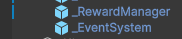

# 유니티 협업 워크플로우 가이드

이 문서는 유니티 에디터 상에서의 작업 충돌을 방지하고, 리소스 관리의 효율성을 높이기 위한 규칙을 정의합니다.
모든 팀원은 작업 전 이 문서를 숙지해주시길 바랍니다.

---

## 1. 프리팹(Prefab) 작업 원칙

**"하이어라키의 모든 오브젝트는 파란색(Prefab Instance)이어야 한다."**

### 1-1. 프리팹 사용 의무화
* 씬에 배치되는 캐릭터, 아이템, UI 요소 등은 반드시 **프리팹으로 만든 뒤 배치**합니다.
  * _(기존에 Hierarchy에 있던 Raw 객체를 Project로 드래그 앤 드롭해도 프리팹으로 만들어집니다.)_ 
* **Raw Object 사용 금지:** `Create Empty`나 `Sprite`를 만들고 프리팹화 하지 않은 상태로 방치하지 않습니다.

### 1-2. 수정 규칙 (Override 주의)
* **원칙:** 기능 수정이나 밸런스 조정은 **프로젝트 창에서 프리팹을 열어서** 진행합니다.
* **하이어라키 직접 수정:** 배치나 해당 씬에서만 적용되는 특수한 값 변경 외에는, 하이어라키 인스펙터에서 값을 직접 수정(Override)하지 않습니다.
    * *이유: 하이어라키에서 값을 덮어쓰면, 나중에 원본 프리팹을 수정해도 반영되지 않습니다.*


- Hierarchy 예시 이미지입니다. 왼쪽에 파란 바가 보이면 Override된 객체입니다. 이런 경우 원본 프리팹이 수정되어도 반영되지 않습니다. 

---

## 2. 하이어라키(Hierarchy) 명명 규칙

객체를 쉽게 식별하고 검색할 수 있도록 통일된 이름을 사용합니다.

### 2-1. 네이밍 컨벤션 요약

| 구분         | 규칙               | 예시                            | 비고             |
|:-----------|:-----------------|:------------------------------|:---------------|
| **매니저/핵심** | `_` + PascalCase | `_GameManager`, `_MainCamera` | 최상단 위치 유도      |
| **그룹(폴더)** | 복수형 명사 (Plural)  | `Lights`, `Monsters`, `Traps` | 특수문자 지양        |
| **UI 객체**  | 기능 + `_` + 타입    | `Login_Btn`, `Score_Txt`      | 접미사 사용 (검색 용이) |
| **일반 객체**  | PascalCase       | `Player`, `RedPotion`         | 띄어쓰기 없이 작성     |


### 2-2. 컴포넌트(UI 객체) 네이밍 컨벤션 예시

| **컴포넌트**       | **접미사**       | **예시**                            |
|----------------|---------------|-----------------------------------|
| **Button**     | **`_Btn`**    | `Start_Btn`, `Close_Btn`          |
| **Text (TMP)** | **`_Txt`**    | `Title_Txt`, `Score_Txt`          |
| **Image**      | **`_Img`**    | `Profile_Img`, `Background_Img`   |
| **Slider**     | **`_Slider`** | `Volume_Slider`, `Exp_Slider`     |
| **Toggle**     | **`_Tgl`**    | `Mute_Tgl`, `Auto_Tgl`            |
| **InputField** | **`_Input`**  | `Name_Input`, `Chat_Input`        |
| **Dropdown**   | **`_Drop`**   | `Resolution_Drop`, `Quality_Drop` |

### 2-3. Hierarchy 구조 예시

```text
🔽 _Core
    _GameManager
    _AudioManager

🔽 Environment
    Global Volume
    🔽 Map_Level01
        Ground
        Buildings

🔽 HUD_Canvas
    HP_Slider
    EXP_Slider
    🔽 Pause_Panel
        Resume_Btn
        Quit_Btn
```

## 3. 에디터 설정 및 기타

### 3-1. 에셋 직렬화 (필수)
* **설정 위치:** `Project Settings` -> `Editor` -> `Asset Serialization`
* **값:** **Force Text**
* *이유: 씬이나 프리팹 충돌 시 Git에서 텍스트(YAML) 비교를 통해 해결하기 위함입니다. Binary로 되어 있으면 병합이 불가능합니다.*
* **이미 되어 있으나, 정보 공유 목적에서 작성!**

### 3-2. 메타 파일
* 유니티 밖(윈도우 탐색기/Finder)에서 파일의 이름을 바꾸거나 이동하지 마세요.
* 반드시 **유니티 프로젝트 뷰 내부**에서 수행해야 `.meta` 파일(참조 ID)이 깨지지 않습니다.

### 3-3. 작업 공유
* 중요한 씬(특히 `InGame_Scene`)을 대대적으로 수정할 때는, 팀 메신저에 **"지금 인게임 씬 작업 중입니다"**라고 공유하여 중복 작업을 방지합니다.

---

## 4. 씬(Scene) 구조 및 관리 전략(미정)

**이 항목은 확장 가능성인데 미리 적어둔 내용입니다. 지금은 무시하세요!** <br>
**여러 스테이지를 구현하게 되거나, 씬 병합 충돌이 잦으면 이런 방식이 필요할 수 있습니다.**

씬 병합 충돌을 원천 차단하기 위해 **기능별로 씬을 분리하고, 런타임에 병합(Additive)**하는 방식을 사용합니다.

### 4-1. 씬 분리 원칙
* **Main Menu:** UI 위주의 단순한 구조이므로 단일 씬으로 유지합니다.
* **In-Game:** 레벨 디자인과 UI 작업의 충돌 방지를 위해 **월드(World)**와 **UI**를 분리합니다.

| 씬 분류    | 파일명 예시         | 역할 및 포함 요소                                          |
|:--------|:---------------|:----------------------------------------------------|
| **시스템** | `ManagerScene` | `GameManager`, `AudioManager` 등 (DontDestroyOnLoad) |
| **월드**  | `InGame_World` | 지형, 몬스터 스포너, 환경 오브젝트 (Canvas 없음)                    |
| **UI**  | `InGame_UI`    | 인게임 HUD, 인벤토리, 팝업 등 (Canvas, EventSystem만 존재)       |

### 4-2. 씬 로드 방식
인게임 진입 시, 월드 씬 위에 UI 씬을 겹쳐서 로드합니다.

```csharp
public void LoadInGame()
{
    // 1. 월드 로드 (기존 씬 대체)
    SceneManager.LoadScene("InGame_World", LoadSceneMode.Single);
    
    // 2. UI 로드 (월드 위에 겹치기)
    SceneManager.LoadScene("InGame_UI", LoadSceneMode.Additive);
}
```